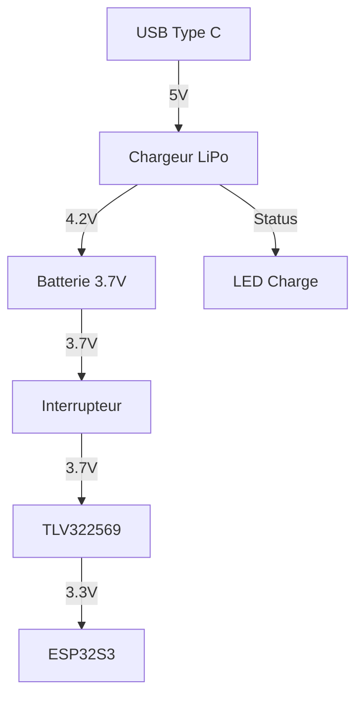

# Schémas de Câblage Romi Box

## Circuit d'Alimentation

### Composants
1. USB Type C
2. Chargeur LiPo
3. Batterie LiPo 3.7V 2200mAh
4. Interrupteur ON/OFF
5. Convertisseur TLV322569 3.3V
6. LED de charge

### Connexions


### Points de Test
1. TP1: Sortie USB (5V)
2. TP2: Sortie batterie (3.7V)
3. TP3: Sortie convertisseur (3.3V)

## Circuit des Boutons

### Disposition
```
[R1]  [B1]  [B2]  [J1]  [J2]
[V1]  [V2]  [W1]  [W2]  [N1]
[N2]  [N3]  [N4]  [N5]  [N6]
```

### Connexions ESP32S3
```cpp
const int buttonPins[15] = {
    1,  // Rouge
    2,  // Bleu 1
    3,  // Bleu 2
    4,  // Jaune 1
    5,  // Jaune 2
    6,  // Vert 1
    7,  // Vert 2
    8,  // Blanc 1
    9,  // Blanc 2
    10, // Noir 1
    11, // Noir 2
    12, // Noir 3
    13, // Noir 4
    14, // Noir 5
    15  // Noir 6
};
```

## Vérifications

### Test Alimentation
1. Mesurer tension USB : 5V ±0.25V
2. Mesurer tension batterie : 3.7-4.2V
3. Mesurer sortie convertisseur : 3.3V ±0.1V

### Test Boutons
1. Vérifier continuité GPIO-Bouton
2. Tester pull-up interne
3. Vérifier rebond <10ms

## Notes d'Assemblage

### Ordre de Montage
1. Préparer circuit d'alimentation
2. Tester convertisseur
3. Connecter ESP32S3
4. Câbler boutons
5. Test final

### Points d'Attention
- Polarité batterie
- Soudures boutons
- Dissipation thermique
- Protection court-circuit